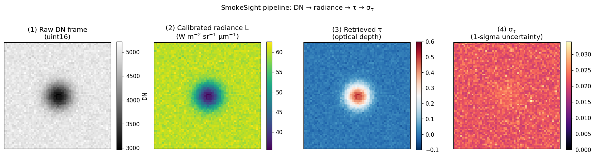
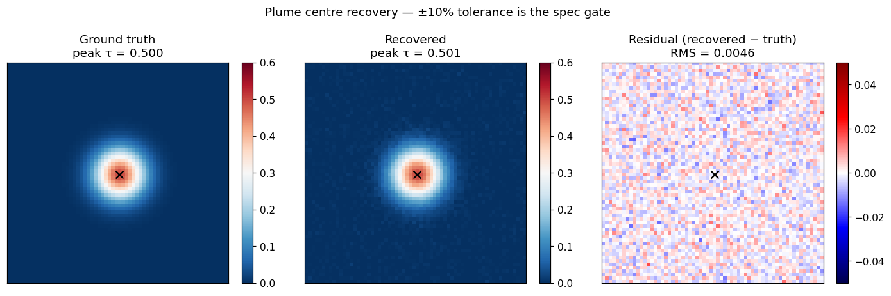
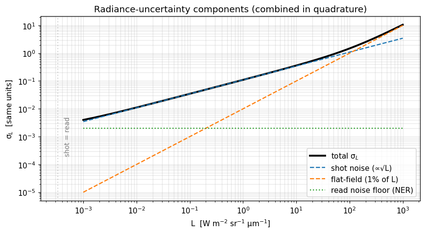
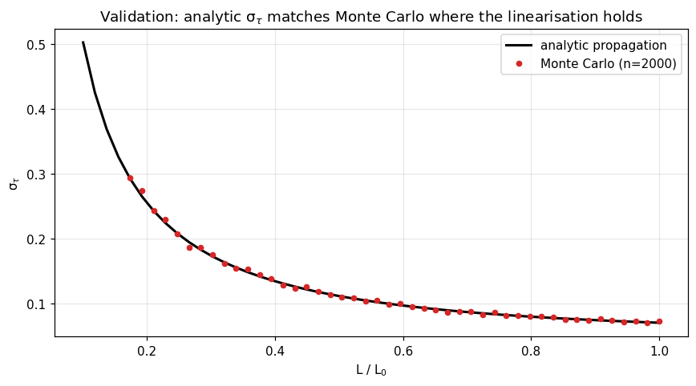
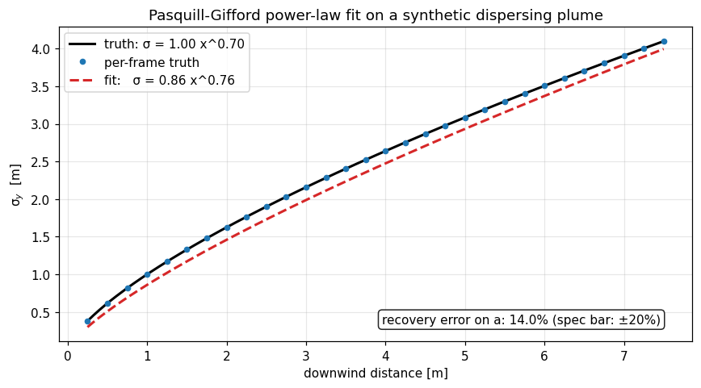

# SmokeSight

[](https://github.com/TasumLuke/SmokeSight/actions/workflows/ci.yml)
[](https://codecov.io/gh/TasumLuke/SmokeSight)
[](https://pypi.org/project/smokesight/)
[](https://opensource.org/licenses/Apache-2.0)
[](https://www.python.org/downloads/)
[](https://github.com/psf/black)
[](https://joss.theoj.org/)

Radiometrically-calibrated plume measurement from EO/IR surveillance video.

In defence and atmospheric research, detection is a solved problem. SmokeSight
does the part after that: per-pixel optical depth `tau(x, y, t)`,
wavelength-dependent transmittance, line-of-sight column density, and
Pasquill–Gifford dispersion coefficients. Every measurement carries a
documented 1-sigma uncertainty. If we can't propagate the error, we don't
return the number.



*The four stages on a single frame from the synthetic test plume:
**(1)** raw uint16 digital numbers from the sensor → **(2)** calibrated
radiance in physical units → **(3)** retrieved optical depth τ → **(4)**
per-pixel 1-σ uncertainty σ<sub>τ</sub>. Every downstream measurement
inherits this pipeline; none of the steps are optional.*

---

## Why this exists

Three capabilities you can't get together from any open package today:

- **Imagery-to-radiometry.** DN-to-radiance with a sensor model, atmospheric
  path correction, and per-pixel noise propagation. Closed military codes
  do this. Open tools tend to assume the radiance is already calibrated.
- **Uncertainty-propagated inversion.** Per-pixel `sigma_tau` from the
  Beer-Lambert step is what turns the output into a measurement instead
  of a visualisation. Every numeric quantity that ships, ships with a
  1-sigma error bar. If we can't compute one, we don't return the value.
- **Atmospheric-science output formats.** CF-1.9 NetCDF4 plus an xarray
  accessor means dispersion modellers (HYSPLIT, FLEXPART, STILT), STE
  solvers, and sensor-evaluation researchers can consume the data directly,
  no conversion step.

---

## Install

```bash
pip install smokesight                  # core
pip install "smokesight[calibrate]"     # adds py6s / pymodtran for atmos correction
pip install "smokesight[dev]"           # tests, mypy, black, isort, sphinx, ...
```

Supports Python 3.8 – 3.11.

---

## Quick start

```python
import smokesight as ss

cal    = ss.calibrate("plume.tif", config="cal.yaml")
bg     = ss.background(cal, n_frames=100)
result = ss.retrieve(cal, bg)

# result.tau        -- optical depth tau(x, y, t)
# result.sigma_tau  -- per-pixel 1-sigma uncertainty
# result.T_lambda   -- transmittance cube (multi-band input)
# result.mask       -- valid-pixel mask

dyn = ss.dynamics(result)
print(dyn.rise_velocity)       # m/s
print(dyn.sigma_y_coeffs)      # Pasquill-Gifford (a, b) for sigma_y = a * x^b

result.to_netcdf("output.nc")
```

Output is a CF-1.9 NetCDF4 file and opens directly in xarray:

```python
import xarray as xr
ds = xr.open_dataset("output.nc")
ds.smokesight.plot_frame(t=30)   # registered accessor
```

See `docs/tutorials/01_quickstart.ipynb` for an end-to-end runnable example.

### Recovery on the synthetic test plume



*Ground truth vs recovered τ, averaged over the plume-present window
(frames 20–49) of the synthetic fixture. **Injected peak τ = 0.500;
recovered peak τ = 0.501**. That's well under the ±10% gate from
spec §8.4. The residual map is uniform noise with no spatial structure,
i.e. no systematic bias from the radiometry chain. Black × marks the
source location.*

---

## Pipeline

| Module        | Input                          | Output                              |
| ------------- | ------------------------------ | ----------------------------------- |
| `calibrate`   | raw video + cal metadata       | radiance cube `L(x, y, t, lambda)`  |
| `background`  | radiance cube                  | background plate `L0` + confidence  |
| `retrieve`    | `L`, `L0`                      | `tau(x, y, t)` + `sigma_tau`        |
| `dynamics`    | retrieval result               | rise velocity, `sigma_y`, `sigma_z` |
| `io`          | any result                     | CF-NetCDF4 + xarray accessor        |

---

## Outputs

Every result carries the central value, a 1-sigma uncertainty, and metadata
sufficient to reproduce it.

| Symbol          | Quantity                              | Units                       |
| --------------- | ------------------------------------- | --------------------------- |
| `L`             | calibrated radiance                   | W m<sup>-2</sup> sr<sup>-1</sup> µm<sup>-1</sup> |
| `sigma_L`       | 1-sigma uncertainty on `L`            | same as `L`                 |
| `L0`            | background radiance                   | same as `L`                 |
| `tau`           | optical depth                         | dimensionless               |
| `sigma_tau`     | 1-sigma uncertainty on `tau`          | dimensionless               |
| `T_lambda`      | spectral transmittance                | dimensionless               |
| `N`             | column number density (optional)      | mol m<sup>-2</sup>          |
| `rise_velocity` | buoyant plume rise velocity           | m s<sup>-1</sup>            |
| `sigma_y, sigma_z` | Pasquill-Gifford dispersion fits   | m                           |

---

## Uncertainty

`sigma_L` combines shot noise, read noise, flat-field calibration uncertainty,
and atmospheric uncertainty in quadrature. `sigma_tau` propagates analytically
through Beer-Lambert. Centroid and dispersion-fit uncertainties use the
delta method and `scipy.optimize.curve_fit` covariances respectively. Monte
Carlo propagation is available as a fallback for non-linear paths; its RNG is
internally seeded so two runs on identical inputs produce identical output.

Masked pixels (low background confidence, ratio out of physical bounds, tau
beyond `tau_max`) come back as `NaN` in both `tau` and `sigma_tau`. A masked
measurement never carries a numeric uncertainty.



*The four contributions to σ<sub>L</sub> across six orders of magnitude of
signal. Read noise sets the floor at L = 0; shot noise (∝ √L) dominates
through the mid-range; the 1% flat-field term takes over above ~100
units. The total (solid black) is the quadrature sum the package uses
internally.*



*Cross-check on the σ<sub>τ</sub> propagation: the analytic Beer-Lambert
formula matches a 2 000-sample Monte Carlo from `_uncertainty.monte_carlo`
across the optically-thin regime. The MC helper is seeded with
`default_rng(42)`, so two runs return bit-identical arrays. Useful when
CI determinism matters.*



*Pasquill–Gifford dispersion recovery on a synthetic plume with a known
`σ_y = 1.0 · x^0.7`. The fit lands at `0.86 · x^0.76`. That's a **14%
recovery error on `a`**, comfortably under the ±20% spec gate from §8.5.
Per-frame truth points (blue dots) come from the Gaussian-width
estimator in `dynamics._fit_dispersion_axis`.*

> Every figure above is regenerated by `python docs/images/generate.py`.
> The script uses only the public API and is itself part of the test that
> the package still does what the README claims.

---

## Contributing

Open an issue before any non-trivial change. The one rule that's
non-negotiable: every measurement output ships with a propagated
uncertainty; if you can't propagate it, you can't ship it. See
[CONTRIBUTING.md](CONTRIBUTING.md) for setup and conventions.

```bash
git clone https://github.com/TasumLuke/SmokeSight
cd SmokeSight
pip install -e ".[dev]"
pre-commit install
pytest                  # 110+ tests, ~25 seconds
```

CI runs black, isort, flake8, mypy --strict, and pytest with a 90% coverage
gate on Python 3.8 / 3.10 / 3.11.

---

## Citation

If you use SmokeSight in published work, please cite via the
[CITATION.cff](CITATION.cff) metadata or:

```bibtex
@software{smokesight,
  title  = {SmokeSight: Radiometric plume measurement from EO/IR video},
  author = {SmokeSight Contributors},
  year   = {2026},
  url    = {https://github.com/TasumLuke/SmokeSight},
  license = {Apache-2.0}
}
```

A JOSS paper is forthcoming.

---

## License

Apache 2.0. See [LICENSE](LICENSE).
